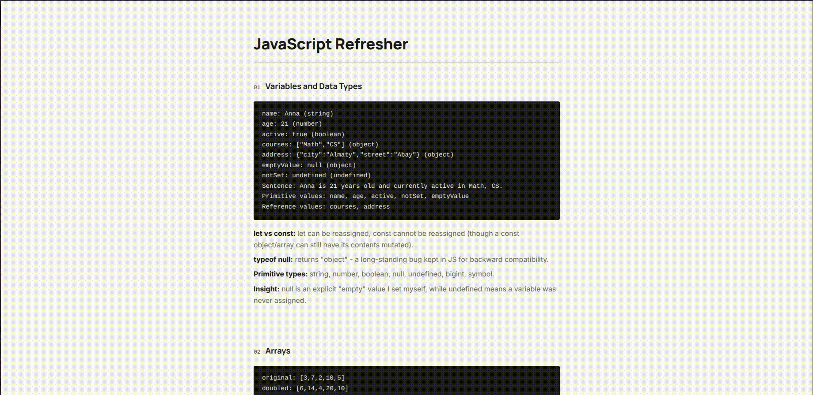

# JS Refresher (Task 0)

Warm-up before starting React. One page (`page.html`), one section per exercise from the task sheet - each prints its actual output plus a short note on what I noticed.

## Run it

No build step, just open `page.html` in a browser.



## Structure

```
page.html          one <section> per task
styles.css
js/
  main.js          runs everything on page load
  shared/render.js  prints results into the page
  tasks/            task1.js ... task11.js, taskFinal.js
```

Split into one file per task instead of one giant `script.js` - easier to find things. Plain `<script defer>` tags, no bundler.

## A few things that clicked

- `var`/`let`/`const` scoping makes way more sense once you break it on purpose (task 8).
- Closures (task 9): the inner function carries its own little backpack of variables around.
- `{ ...obj }` is a **shallow** copy - nested objects still share a reference (task 5).
- `??` vs `||`: `||` treats `0`/`""`/`false` as "missing", `??` doesn't.
